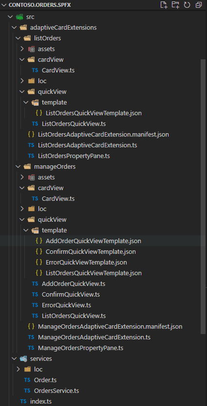
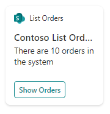
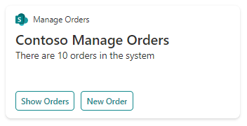
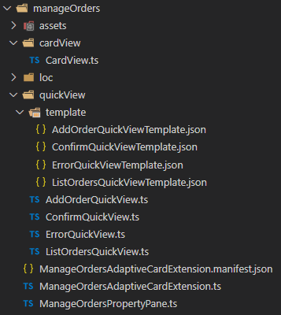
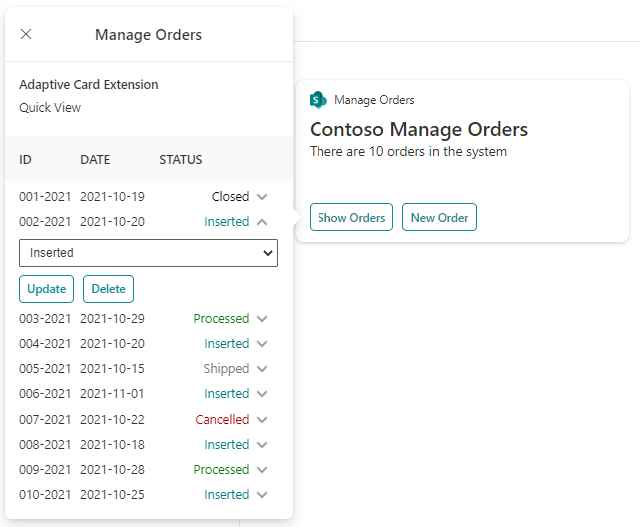

# ACEs Implementation Details

The source code of the ACEs solution is available [here](../src/Contoso.Orders.SPFx). 
In the following picture you can see the outline of the solution in Visual Studio Code.



## OrdersService
From an implementation point of view, both the ACEs (ListOrders and ManageOrders) rely on a service called **OrdersService** and defined in file [OrderService.ts](../src/Contoso.Orders.SPFx/src/services/OrdersService.ts) under the services folder.

The service provides all the basic CRUDQ (Create, Read, Update, Delete, Query) functionalities and is supported by the [backend APIs](./APIs-Implementation-Details.md). In the following code excerpt you can see the interface implemented by the service.

```TypeScript
/**
 * Defines the abstract interface for the Orders Service
 */
export interface IOrdersService {

    /**
     * Returns the whole list of orders
     * @returns The whole list of orders
     */
    GetOrders: () => Promise<Order[]>;

    /**
     * Retrieves a specific order by ID
     * @param id The ID of the order to retrieve
     * @returns A specific order by ID
     */
    GetOrder: (id: string) => Promise<Order>;

    /**
     * Adds a new order
     * @param order The order to add
     * @returns The just inserted order
     */
    AddOrder: (order: Order) => Promise<Order>;

    /**
     * Updates an already existing order
     * @param order The updated order to save
     * @returns The just updated order
     */
    UpdateOrder: (order: Order) => Promise<Order>;

    /**
     * Deletes a specific order by ID
     * @param id The ID of the order to delete
     */
    DeleteOrder: (id: string) => Promise<void>;
}
```

The service provides a constructor that accepts an instance of the **AadHttpClient** type of SPFx and the base URL of the service.

```TypeScript
constructor(aadClient: AadHttpClient, serviceBaseUrl: string)
```

Internally, the service relies on the provided **AadHttpClient** instance to invoke the back-end API. For example, in the following code excerpt you can see how the **UpdateOrder** method is implemented.

```TypeScript
     /**
      * Updates an already existing order
      * @param order The updated order to save
      * @returns The just updated order
      */
    public async UpdateOrder(order: Order): Promise<Order> {

        try {
            // Define the HTTP request headers
            const requestHeaders: Headers = new Headers();
            requestHeaders.append('Content-type', 'application/json');

            // Configure the request options
            const httpOptions: IHttpClientOptions = {
                method: "PUT",
                body: JSON.stringify(order),
                headers: requestHeaders
            };

            // Make the actual HTTP request
            const httpResponse = await this.aadClient.fetch(
                `${this.serviceBaseUrl}/api/orders/${order.id}`, 
                AadHttpClient.configurations.v1,
                httpOptions);

            if (httpResponse.status === 403) {
                throw new OrderServiceError(strings.ErrorForbidden);
            }
            else if (httpResponse.status !== 200) {
                throw new OrderServiceError(strings.ErrorUpdatingOrder);
            }

            // Parse the JSON response
            const result: Order = await httpResponse.json();

            // Return the single order
            return result;
        } catch (error) {
            if (error instanceof OrderServiceError) {
                throw error;
            } else {
                throw new OrderServiceError(`${strings.ErrorUpdatingOrder}: ${error.message}`);
            }
        }
    }
```

Internally the **AadHttpClient** instance takes care of all the complexity of retrieving a valid OAuth 2.0 Access Token to consume the backend API. In order to being able to consume the target API from SPFx, securing the communication with OAuth 2.0 and Azure Active Directory (AAD), you need to configure in the [package-solution.json](../src/Contoso.Orders.SPFx/config/package-solution.json) the permission requests needed by SPFx. Here you can see the content of the package-solution.json file.

```JSON
{
  "$schema": "https://developer.microsoft.com/json-schemas/spfx-build/package-solution.schema.json",
  "solution": {
    "name": "contoso-orders-client-side-solution",
    "id": "093eebef-9dbb-4b13-ba09-4da180bceb6d",
    "version": "1.0.0.0",
    "includeClientSideAssets": true,
    "skipFeatureDeployment": true,
    "isDomainIsolated": false,
    "developer": {
      "name": "Microsoft 365 PnP",
      "websiteUrl": "https://aka.ms/m365pnp",
      "privacyUrl": "",
      "termsOfUseUrl": "",
      "mpnId": "Undefined-1.13.0"
    },
    "webApiPermissionRequests": [
      {
        "resource": "PnP.Contoso.Orders",
        "scope": "Orders.FullControl"
      }
    ]
  },
  "paths": {
    "zippedPackage": "solution/contoso-orders.sppkg"
  }
}
```

Notice the **webApiPermissionRequests** section, where we define that we need the **Orders.FullControl** permission scope for the resource **PnP.Contoso.Orders**, which represents the app registered in AAD for the backend API. 

> Note: you can find further details about how to register the backend API in ADD reading the document about the [backend APIs](./APIs-Implementation-Details.md). You can also find additional information about how to use AadHttpClient in SPFx by reading the document [Connect to Azure AD-secured APIs in SharePoint Framework solutions](https://docs.microsoft.com/en-us/sharepoint/dev/spfx/use-aadhttpclient).

For the sake of completeness, the sample defines also a set of localized strings for the service, in the loc sub-folder of the services folder. In order to properly support localized strings defined in such a way, you also need to add an item to the localizedResources section of the [config.json](../src/Contoso.Orders.SPFx/config/config.json) file.

```JSON
  "localizedResources": {
    "ListOrdersAdaptiveCardExtensionStrings": "lib/adaptiveCardExtensions/listOrders/loc/{locale}.js",
    "ManageOrdersAdaptiveCardExtensionStrings": "lib/adaptiveCardExtensions/manageOrders/loc/{locale}.js",
    "OrderServiceStrings": "lib/services/loc/{locale}.js"
  }
```

## Adaptive Card Extensions (ACEs)
Both the ACEs rely on the OrderService class to consume the backend API.

### ListOrders
Let's consider for example the ListOrders extension. The ListOrders ACE is defined in the [ListOrdersAdaptiveCardExtension.ts](../src/Contoso.Orders.SPFx/src/adaptiveCardExtensions/listOrders/ListOrdersAdaptiveCardExtension.ts) file.
Notice the declaration of the **IListOrdersAdaptiveCardExtensionProps** and **IListOrdersAdaptiveCardExtensionState** to hold the properties and the state of the ACE. The definition of the ACE relies on those two interfaces and the out of the box infrastructure of SPFx will share both properties and state with all the cards (CardViews and QuickViews) related to the ACE.

```TypeScript
export interface IListOrdersAdaptiveCardExtensionProps {
  title: string;
  iconProperty: string;
  serviceBaseUrl: string;
}

export interface IListOrdersAdaptiveCardExtensionState {
  description: string;
  orders?: Order[];
}

[...]

export default class ListOrdersAdaptiveCardExtension extends BaseAdaptiveCardExtension<
  IListOrdersAdaptiveCardExtensionProps,
  IListOrdersAdaptiveCardExtensionState> {
```

Notice the **orders** property defined in the state, and which will hold the whole list of orders to use them in the UI binding. 
In the **onInit** method of the ACE there is some logic to setup the initial state of the component, to register the CardViews and the QuickViews of the ACE, and to create a new instance of the **AadHttpClient** type, which will then be used to create an instance of the OrderService.
Notice also the **setTimeout** JavaScript method invokation, to trigger an asynchronous load of all the orders. You could eventually load the orders within the **onInit** method, instead of using an asynchronous method via **setTimeout** but in case of any delay in loading orders, the ACE would be "stuck" in the UI. That's why in the sample we rather load orders asynchronously.

```TypeScript
export default class ListOrdersAdaptiveCardExtension extends BaseAdaptiveCardExtension<
  IListOrdersAdaptiveCardExtensionProps,
  IListOrdersAdaptiveCardExtensionState
> {
  private _deferredPropertyPane: ListOrdersPropertyPane | undefined;
  private aadClient: AadHttpClient;

  public async onInit(): Promise<void> {
    this.state = {
      description: strings.LoadingMessage
    };

    this.cardNavigator.register(CARD_VIEW_REGISTRY_ID, () => new CardView());
    this.quickViewNavigator.register(LISTORDERS_QUICK_VIEW_REGISTRY_ID, () => new ListOrdersQuickView());

    // Create the AadHttpClient instance for the back-end API via aadHttpClientFactory
    this.aadClient = await this.context.aadHttpClientFactory.getClient("api://pnp.contoso.orders");

    setTimeout(this.loadOrders, 500);

    return Promise.resolve();
  }

  private loadOrders = async () => {

    // Skip in case we are missing settings
    if (this.properties.serviceBaseUrl === undefined || this.properties.serviceBaseUrl.length == 0)
    {
      this.setState({
        description: strings.ConfigureMessage,
        orders: []
      });
      if (this.displayMode == DisplayMode.Edit) {
        this.context.propertyPane.open();
      }
    }
    else
    {
      try {

        // Create an instance of the OrderService
        const ordersService = new OrdersService(this.aadClient, this.properties.serviceBaseUrl);

        // Use it to get the list of orders
        const orders = await ordersService.GetOrders();

        this.setState({
          description: `There are ${orders.length} orders in the system`,
          orders: orders
        });

      } catch (error) {

        this.setState({
          description: error.message,
          orders: []
        });

        console.log(error);
      }
    }
  }

[...]
```

The **loadOrders** method simply creates a new instance of the **OrderService** providing the expected input objects to the constructor and then makes a request to the **GetOrders** method, setting the resulting orders in the state of the component. 

Another interesting part of the ListOrders extension implementation is the **onPropertyPaneFieldChanged** method.

```TypeScript
  protected async onPropertyPaneFieldChanged(propertyPath: string, oldValue: any, newValue: any): Promise<void> {
    if (propertyPath == 'serviceBaseUrl') {
      await this.loadOrders();
    }
  }
```

In fact, whenever the **serviceBaseUrl** property value changes, the method triggers a refresh of the orders via the **loadOrders** method.

Once the orders are loaded, the default **CardView** of the ACE inherits from **BasePrimaryTextCardView** and simply shows the value of **this.state.description** as the description of the CardView. Moreover, there is a "Show Orders" button that is shown in the **CardView** if and only if there are orders available in the current state.

```TypeScript
  public get cardButtons(): [ICardButton] | [ICardButton, ICardButton] | undefined {
    if (this.state.orders != null && this.state.orders.length > 0) {
      return [
        {
          title: strings.QuickViewButton,
          action: {
            type: 'QuickView',
            parameters: {
              view: LISTORDERS_QUICK_VIEW_REGISTRY_ID
            }
          }
        }
      ];
    } else {
      return undefined;
    }
  }
```



Once you click on the button, as you can see the action type associated is **QuickView** and the associated QuickView is the one showing the whole list of orders: **ListOrdersQuickView**.
Here you can see the implementation of the [ListOrdersQuickView](../src/Contoso.Orders.SPFx/src/adaptiveCardExtensions/listOrders/quickView/ListOrdersQuickView.ts) type.

```TypeScript
import { ISPFxAdaptiveCard, BaseAdaptiveCardView } from '@microsoft/sp-adaptive-card-extension-base';
import * as strings from 'ListOrdersAdaptiveCardExtensionStrings';
import { IListOrdersAdaptiveCardExtensionProps, IListOrdersAdaptiveCardExtensionState } from '../ListOrdersAdaptiveCardExtension';
import { Order } from '../../../services/Order';

export interface IListOrdersQuickViewData {
  title: string;
  subTitle: string;
  orders: Order[];
}

export class ListOrdersQuickView extends BaseAdaptiveCardView<
  IListOrdersAdaptiveCardExtensionProps,
  IListOrdersAdaptiveCardExtensionState,
  IListOrdersQuickViewData
> {
  public get data(): IListOrdersQuickViewData {
    return {
      title: strings.QuickViewTitle,
      subTitle: strings.QuickViewSubTitle,
      orders: this.state.orders
    };
  }

  public get template(): ISPFxAdaptiveCard {
    return require('./template/ListOrdersQuickViewTemplate.json');
  }
}
```


As you can see, the implementation is really simple and straightforward. We simply define a type **IListOrdersQuickViewData** to hold the data that will be rendered via databinding in the UI of the Adaptive Card rendering the QuickView. The code simply configures the orders property of the **IListOrdersQuickViewData** instance with a value equal to the **this.state.orders** value.
Then all the magic happens in the [ListOrdersQuickViewTemplate.json](../src/Contoso.Orders.SPFx/src/adaptiveCardExtensions/listOrders/quickView/template/ListOrdersQuickViewTemplate.json) adaptive card.

```JSON
{
  "schema": "http://adaptivecards.io/schemas/adaptive-card.json",
  "type": "AdaptiveCard",
  "version": "1.2",
  "body": [
    {
      "type": "TextBlock",
      "weight": "Bolder",
      "text": "${title}"
    },
    {
      "type": "TextBlock",
      "text": "${subTitle}",
      "wrap": true
    },
    {
      "type": "Container",
      "spacing": "Large",
      "style": "emphasis",
      "items": [
        {
          "type": "ColumnSet",
          "columns": [
            {
              "type": "Column",
              "items": [
                {
                  "type": "TextBlock",
                  "weight": "Bolder",
                  "text": "ID",
                  "wrap": true
                }
              ],
              "width": "60px"
            },
            {
              "type": "Column",
              "spacing": "Large",
              "items": [
                {
                  "type": "TextBlock",
                  "weight": "Bolder",
                  "text": "CUST.",
                  "wrap": true
                }
              ],
              "width": "60px"
            },
            {
              "type": "Column",
              "items": [
                {
                  "type": "TextBlock",
                  "weight": "Bolder",
                  "text": "DATE",
                  "wrap": true
                }
              ],
              "width": "80px"
            },
            {
              "type": "Column",
              "items": [
                {
                  "type": "TextBlock",
                  "weight": "Bolder",
                  "horizontalAlignment": "Right",
                  "text": "STATUS",
                  "wrap": true
                }
              ],
              "width": "100px"
            }
          ]
        }
      ],
      "bleed": true
    },
    {
      "$data": "${orders}",
      "type": "Container",
      "items": [
        {
          "type": "ColumnSet",
          "columns": [
            {
              "type": "Column",
              "items": [
                {
                  "type": "TextBlock",
                  "text": "${id}",
                  "wrap": true
                }
              ],
              "width": "60px"
            },
            {
              "type": "Column",
              "spacing": "Large",
              "items": [
                {
                  "type": "TextBlock",
                  "text": "${customerId}",
                  "wrap": true
                }
              ],
              "width": "60px"
            },
            {
              "type": "Column",
              "items": [
                {
                  "type": "TextBlock",
                  "text": "${formatDateTime(date, 'yyyy-MM-dd')}",
                  "wrap": true
                }
              ],
              "width": "80px"
            },
            {
              "type": "Column",
              "items": [
                {
                  "type": "TextBlock",
                  "horizontalAlignment": "Right",
                  "text": "${status}",
                  "color": "${if(status == 'Inserted', 'accent', if(status == 'Processing', 'good', if(status == 'Processed', 'good', if(status == 'Shipped', 'warning', if(status == 'Delivered', 'dark', if(status == 'Closed', 'dark', if(status == 'Cancelled', 'attention', 'default')))))))}",
                  "wrap": true
                }
              ],
              "width": "100px"
            }
          ]
        }
     ]
    }
  ]
}
```

The **Title** and **SubTitle** are rendered via the Adaptive Card databinding syntax **${title}** and **${subTitle}**. Then the collection of orders is rendered configuring **"$data": "${orders}"** in the Container defined in the card definition. For each order item in the **orders** collection, the JSON renders a set of properties via databinding.
Notice the logic inside the Adaptive Card to handle the different values of the **status** property of each order in order to define the color for the status string.

### ManageOrders
The ManageOrders ACE internally works almost the same as the ListOrders one. For example, the CardView still shows a message about the number of orders defined in the system. However, there are two buttons in the CardView (when it is configured to show in *Large* mode): one to show orders ad another one to add a new order.



```TypeScript
  public get cardButtons(): [ICardButton] | [ICardButton, ICardButton] | undefined {

    if (this.state.orders != null && this.state.orders.length > 0) {
      return [
        {
          title: strings.ListOrdersQuickViewButton,
          action: {
            type: 'QuickView',
            parameters: {
              view: LISTORDERS_QUICK_VIEW_REGISTRY_ID
            }
          }
        },
        {
          title: strings.AddOrderQuickViewButton,
          action: {
            type: 'QuickView',
            parameters: {
              view: ADDORDER_QUICK_VIEW_REGISTRY_ID
            }
          }
        }
      ];
    } else {
      return undefined;
    }
  }
```

The **cardButtons** method, when there are orders to manage, shows the two buttons and each of them targets a different QuickView instance.

Overall, in the ManageOrders ACE there are four QuickViews:
- ListOrdersQuickView: to show an editable list of orders
- AddOrderQuickView: to add a new order
- ConfirmQuickView: to confirm the insertion of a new order
- ErrorQuickView: to show an error, in case of failure



In order to support multiple QuickViews (or CardViews) you have to register them in the ACE implementation via the **quickViewNavigator** property of the ACE instance.

```TypeScript
const CARD_VIEW_REGISTRY_ID: string = 'ManageOrders_CARD_VIEW';
export const LISTORDERS_QUICK_VIEW_REGISTRY_ID: string = 'ListOrders_QUICK_VIEW';
export const ADDORDER_QUICK_VIEW_REGISTRY_ID: string = 'AddOrder_QUICK_VIEW';
export const CONFIRM_QUICK_VIEW_REGISTRY_ID: string = 'Confirm_QUICK_VIEW';
export const ERROR_QUICK_VIEW_REGISTRY_ID: string = 'Error_QUICK_VIEW';

export default class ManageOrdersAdaptiveCardExtension extends BaseAdaptiveCardExtension<
  IManageOrdersAdaptiveCardExtensionProps,
  IManageOrdersAdaptiveCardExtensionState
> {
  private _deferredPropertyPane: ManageOrdersPropertyPane | undefined;
  private aadClient: AadHttpClient;

  public async onInit(): Promise<void> {
    this.state = {
      description: strings.LoadingMessage
    };

    this.cardNavigator.register(CARD_VIEW_REGISTRY_ID, () => new CardView());
    this.quickViewNavigator.register(LISTORDERS_QUICK_VIEW_REGISTRY_ID, () => new ListOrdersQuickView());
    this.quickViewNavigator.register(ADDORDER_QUICK_VIEW_REGISTRY_ID, () => new AddOrderQuickView());
    this.quickViewNavigator.register(CONFIRM_QUICK_VIEW_REGISTRY_ID, () => new ConfirmQuickView());
    this.quickViewNavigator.register(ERROR_QUICK_VIEW_REGISTRY_ID, () => new ErrorQuickView());

    // Create the AadHttpClient instance for the back-end API via aadHttpClientFactory
    this.aadClient = await this.context.aadHttpClientFactory.getClient("api://pnp.contoso.orders");

    this.properties.loadOrders = this.loadOrders;
    this.properties.addOrder = this.addOrder;
    this.properties.updateOrder = this.updateOrder;
    this.properties.deleteOrder = this.deleteOrder;

    setTimeout(this.loadOrders, 500);

    return Promise.resolve();
  }

[...]
```

Notice that, in order to provide support for adding, updating, deleting, and loading the orders the ACE defines four methods that are registered in the **this.properties** of the ACE, so that these methods will be accessible to all the cards thanks to the sharing of the properties across the ACE and its cards.

The QuickViews implementation is more complex in the ManageOrders scenario. For example, here follows the source code of the [ListOrdersQuickView.ts](../src/Contoso.Orders.SPFx/src/adaptiveCardExtensions/manageOrders/quickView/ListOrdersQuickView.ts) type.

```TypeScript
import { ISPFxAdaptiveCard, BaseAdaptiveCardView, IActionArguments } from '@microsoft/sp-adaptive-card-extension-base';
import * as strings from 'ManageOrdersAdaptiveCardExtensionStrings';
import { IManageOrdersAdaptiveCardExtensionProps, IManageOrdersAdaptiveCardExtensionState } from '../ManageOrdersAdaptiveCardExtension';
import { Order } from '../../../services/Order';

export interface IListOrdersQuickViewData {
  subTitle: string;
  title: string;
  orders: Order[];
  imageUpUrl: string;
  imageDownUrl: string;
}

export class ListOrdersQuickView extends BaseAdaptiveCardView<
  IManageOrdersAdaptiveCardExtensionProps,
  IManageOrdersAdaptiveCardExtensionState,
  IListOrdersQuickViewData
> {
  public get data(): IListOrdersQuickViewData {
    return {
      subTitle: strings.SubTitle,
      title: strings.Title,
      orders: this.state.orders,
      imageUpUrl:  require('../assets/up.png'),
      imageDownUrl:  require('../assets/down.png')
    };
  }

  public get template(): ISPFxAdaptiveCard {
    return require('./template/ListOrdersQuickViewTemplate.json');
  }

  public onAction(action: IActionArguments | any): void {

    // Get the ID of the button pressed by the user
    const actionId = <string>action.id;

    // Check if the actionId is the one of an update Action.Submit button
    if (actionId.substring(0, 6) == "update") {

      // Determine the order to update, by id
      const ordersById = this.state.orders.filter(o => o.id == action.data.id);

      // If we've found the target order
      if (ordersById != undefined && ordersById.length > 0) {
        // Update the status accordingly to the new value we've got
        ordersById[0].status = action.data[`changeStatus${action.data.itemIndex}`];
        // and update the order
        this.properties.updateOrder(ordersById[0]);
      }
    }
    // Otherwise check if it is a request to delete the current order item
    // Check if the actionId is the one of an update Action.Submit button
    else if (actionId.substring(0, 6) == "delete") {
        // and delete the order
        this.properties.deleteOrder(action.data.id);
    }
  }
}
```

The **IListOrdersQuickViewData** type defines properties to hold the source of databinding for the QuickView. There is an **orders** property to hold the collection of orders in the system and there are two properties (**imageUpUrl** and **imageDownUrl**) that represent the URL of the arrows used to expand/collapse the edit form for a single order.



It interesting to notice the **onAction** method, which handles the post-back of the QuickView UI when the users click on any of the action buttons in the Adaptive Card UI. Let's have a look at the Adaptive Card definition in the [ListOrdersQuickViewTemplate.json](../src/Contoso.Orders.SPFx/src/adaptiveCardExtensions/manageOrders/quickView/template/ListOrdersQuickViewTemplate.json) file, to better understand how the binding and the editing work.

```JSON
{
  "schema": "http://adaptivecards.io/schemas/adaptive-card.json",
  "type": "AdaptiveCard",
  "version": "1.2",
  "body": [
    {
      "type": "TextBlock",
      "weight": "Bolder",
      "text": "${title}"
    },
    {
      "type": "TextBlock",
      "text": "${subTitle}",
      "wrap": true
    },
    {
      "type": "Container",
      "spacing": "Large",
      "style": "emphasis",
      "items": [
        {
          "type": "ColumnSet",
          "columns": [
            {
              "type": "Column",
              "items": [
                {
                  "type": "TextBlock",
                  "weight": "Bolder",
                  "text": "ID",
                  "wrap": true
                }
              ],
              "width": "60px"
            },
            {
              "type": "Column",
              "items": [
                {
                  "type": "TextBlock",
                  "weight": "Bolder",
                  "text": "DATE",
                  "wrap": true
                }
              ],
              "width": "80px"
            },
            {
              "type": "Column",
              "items": [
                {
                  "type": "TextBlock",
                  "weight": "Bolder",
                  "horizontalAlignment": "Right",
                  "text": "STATUS",
                  "wrap": true
                }
              ],
              "width": "auto"
            }
          ]
        }
      ],
      "bleed": true
    },
    {
      "$data": "${orders}",
      "type": "Container",
      "items": [
        {
          "type": "ColumnSet",
          "columns": [
            {
              "type": "Column",
              "items": [
                {
                  "type": "TextBlock",
                  "text": "${id}",
                  "wrap": true
                }
              ],
              "width": "60px"
            },
            {
              "type": "Column",
              "items": [
                {
                  "type": "TextBlock",
                  "text": "${formatDateTime(date, 'yyyy-MM-dd')}",
                  "wrap": true
                }
              ],
              "width": "80px"
            },
            {
              "type": "Column",
              "items": [
                {
                  "type": "TextBlock",
                  "horizontalAlignment": "Right",
                  "text": "${status}",
                  "color": "${if(status == 'Inserted', 'accent', if(status == 'Processing', 'good', if(status == 'Processed', 'good', if(status == 'Shipped', 'warning', if(status == 'Delivered', 'dark', if(status == 'Closed', 'dark', if(status == 'Cancelled', 'attention', 'default')))))))}",
                  "wrap": true
                }
              ],
              "width": "100px"
            },
            {
              "type": "Column",
              "spacing": "Small",
              "selectAction": {
                "type": "Action.ToggleVisibility",
                "targetElements": [
                  "orderContent${$index}",
                  "chevronDown${$index}",
                  "chevronUp${$index}"
                ]
              },
              "verticalContentAlignment": "Center",
              "items": [
                {
                  "type": "Image",
                  "id": "chevronDown${$index}",
                  "url": "${$root.imageDownUrl}",
                  "width": "20px"
                },
                {
                  "type": "Image",
                  "id": "chevronUp${$index}",
                  "url": "${$root.imageUpUrl}",
                  "width": "20px",
                  "isVisible": false
                }
              ],
              "width": "auto"
            }
          ]
        },
        {
          "type": "Container",
          "id": "orderContent${$index}",
          "isVisible": false,
          "items": [
            {
              "type": "Input.ChoiceSet",
              "id": "changeStatus${$index}",
              "style": "compact",
              "isMultiSelect": false,
              "value": "${status}",
              "choices": [
                {
                  "title": "Inserted",
                  "value": "Inserted"
                },
                {
                  "title": "Processing",
                  "value": "Processing"
                },
                {
                  "title": "Processed",
                  "value": "Processed"
                },
                {
                  "title": "Shipped",
                  "value": "Shipped"
                },
                {
                  "title": "Delivered",
                  "value": "Delivered"
                },
                {
                  "title": "Closed",
                  "value": "Closed"
                },
                {
                  "title": "Cancelled",
                  "value": "Cancelled"
                }
              ]
            },
            {
              "type": "ActionSet",
              "actions": [
                {
                  "type": "Action.Submit",
                  "id": "update${$index}",
                  "title": "Update",
                  "data": {
                    "id": "${id}",
                    "itemIndex": "{$index}"
                  }
                },
                {
                  "type": "Action.Submit",
                  "id": "delete${$index}",
                  "title": "Delete",
                  "data": {
                    "id": "${id}",
                    "itemIndex": "{$index}"
                  }
                }
              ]
            }
          ]
        }
     ]
    }
  ]
}
```

The databinding works almost like in the ListOrders ACE. However, there is the **Action.ToggleVisibility** that in conjuction with the **isVisible** property of some of the items, allows to nicely play with the dynamic UI of the list of orders. When a user clicks on the chevron down, the **Action.ToggleVisibility** will hide the chevron down, show the chevron up, and show an item of type **Container** that includes the editing UI for the selected order. The **ActionSet** in the **Container** will trigger a post-back to the QuickView code and will target the **onAction** method that we just saw. Internally that method will update or delete the current item based on the action clicked by the user.

Just for the sake of completeness, the [AddOrderQuickView.ts](../src/Contoso.Orders.SPFx/src/adaptiveCardExtensions/manageOrders/quickView/AddOrderQuickView.ts) QuickView relies on a full edit form experience, defined in the following Adaptive Card JSON template.

```JSON
{
  "schema": "http://adaptivecards.io/schemas/adaptive-card.json",
  "type": "AdaptiveCard",
  "version": "1.2",
  "body": [
    {
      "type": "Container",
      "items": [
        {
          "type": "Input.Text",
          "id": "id",
          "label": "Order ID",
          "isRequired": true,
          "errorMessage": "Required field",
          "placeholder": "${orderIdPlaceholder}"
        },
        {
          "type": "Input.Text",
          "id": "customerId",
          "label": "Customer ID",
          "isRequired": true,
          "errorMessage": "Required field",
          "placeholder": "${customerIdPlaceholder}"
        },
        {
          "type": "Input.Date",
          "id": "date",
          "label": "Date",
          "isRequired": true,
          "errorMessage": "Required field"
        },
        {
          "type": "Input.ChoiceSet",
          "id": "status",
          "label": "Status",
          "style": "compact",
          "isMultiSelect": false,
          "isRequired": true,
          "errorMessage": "Required field",
          "value": "Inserted",
          "choices": [
            {
              "title": "Inserted",
              "value": "Inserted"
            },
            {
              "title": "Processing",
              "value": "Processing"
            },
            {
              "title": "Processed",
              "value": "Processed"
            },
            {
              "title": "Shipped",
              "value": "Shipped"
            },
            {
              "title": "Delivered",
              "value": "Delivered"
            },
            {
              "title": "Closed",
              "value": "Closed"
            },
            {
              "title": "Cancelled",
              "value": "Cancelled"
            }
          ]
        }
      ]
    }
  ],
  "actions": [
    {
      "type": "Action.Submit",
      "title": "Insert Order"
    }
  ]
}
```

Notice how easy it is to define a form with fields and labels, configuring required fields, defining validation exception messages, etc. At the very end, from a developer point of view you simply need to define the Adaptive Card JSON template and you can skip developing complex input validation rules, and you can rather simply benefit of the out of the box functionalities of Adaptive Cards.