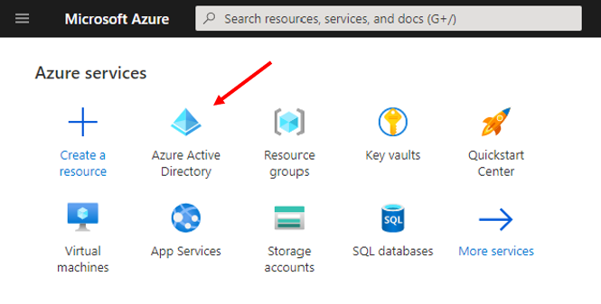
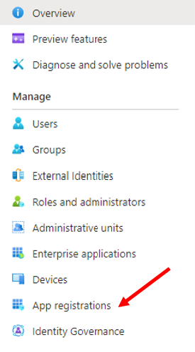
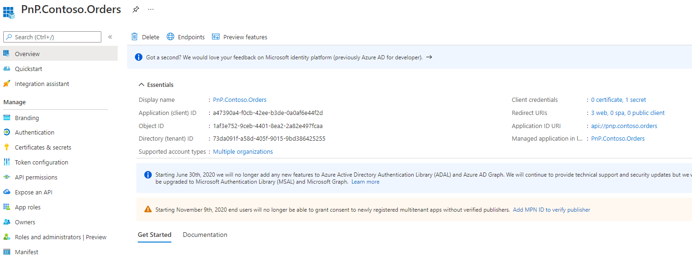
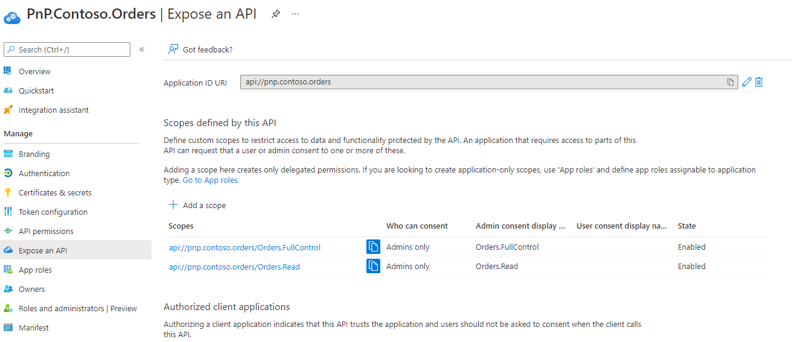

# APIs Implementation Details
The API for this solution is registered in Azure Active Directory (AAD) as a multi-tenant app, and is secured using OAuth 2.0 and custom permission scopes. In this document you will learn how to configure the solution, so that you can do it yourself for any other custom solution that you will develop.
 
## Azure Active Directory app registration
First of all, you need to register a multi-tenant app in Azure Active Directory (AAD) in order to being able to validate users' requests. Choose a tenant that you want to use as the *main* tenant for your app registration. This will be the tenant where you will register and maintain the app settings for all the tenants. 

> Note: you should choose a tenant that is authoritative for your company and you should consider configuring the app as Publisher Verified by following the instructions provided in this [document](https://docs.microsoft.com/en-us/azure/active-directory/develop/publisher-verification-overview). 

Open the browser, go to [https://portal.azure](https://portal.azure), and choose **Azure Active Directory** 



From there, click on **App registrations**.



Then choose **+ New Registration** to start registering a new app in AAD.


You will have to provide the basic settings for a new app, including:
- Name: it is the name of the app. In our sample scenario we're using **PnP.Contoso.Orders** and it is the name also referenced in the [package-solution.json](../src/Contoso.Orders.SPFx/config/package-solution.json#L19) file of the SPFx solution.
- Supported account types: in order to register a multi-tenant app, you should choose *"Accounts in any organizational directory (Any Azure AD directory - Multitenant)"*
- Redirect URI: you can leave this item blank and configure it later, or you can already configure it with the URL https://[function-app-name].azurewebsites.net/api/grant, where [function-app-name] is the name that you will use for hosting the Function App on Microsoft Azure.

> Note: The URL https://[function-app-name].azurewebsites.net/api/grant is a custom one, that corresponds to a function offered by the PnP Contoso Orders sample solution. If you are implementing an API of your own, the URL could be different.

Click on the **Register** button and wait few seconds.


Once the registration is completed, you will be prompted with the AAD app Overview page. Take a note of the followin values:
- Display name
- Application (client) ID
- Directory (tenant) ID



Now click on "Expose an API" in the left menu and configure the app to expose an API.



In this page, first of all you have to configure the Application ID URI for your app. We suggest you to use a value like **api://pnp.contoso.orders**.

> Note: The default value suggested by AAD for the **Application ID URI** is api://GUID where GUID is the ClientId of your app. However, this option is hard to remember and write.

Then you can click on **+ Add a scope** and create all the permission scopes that you want to define for your API. For example, in the current solution we defined:
- Orders.FullControl
- Orders.Read

It is up to you to define a name, a display name, and a description for the permission scopes. When you define them, as you can see in the following screenshot, you have to provide a mandatory **Scope name**. Then, if you choose to configure the scope for **Admins only** consent, you will simply need to provide a display name and a description for admins. If you choose to configure the scope for **Admins and users** you will have to configure display name and description both for admins and users.  


The **Admins only** option means that only Tenant Global Admins will be allowed to register and consent access to the multi-tenant app in their tenant. The **Admins and users** options means that the multi-tenant app can be registered tenant-wide by Tenant Global Admins, or can be registered for personal use per end users. 

> Important: Starting in November 2020, end-users will no longer be able to grant consent to most newly registered multi-tenant apps without verified publishers if risk-based step-up consent is enabled. This will apply to apps that are registered after November 8th 2020, use OAuth2.0 to request permissions beyond basic sign-in and read user profile, and request consent from users in different tenants than the one the app is registered in. A warning will be displayed on the consent screen informing users that these apps are risky and are from unverified publishers. You can find additional information in this [document](https://docs.microsoft.com/en-us/azure/active-directory/develop/publisher-verification-overview).

Lastly, when you create a new permission scope, you have to configure it as **Enabled** in order to being able to use it.

## Visual Studio API solution
The source code of the back-end APIs solution is available [here](../src/Contoso.Orders.FunctionApp). 
In the following picture you can see the outline of the solution in Visual Studio.


The solution is an Azure Function App based on .NET Core 3.1 and configured to provide HTTP-triggered functions.
Moreover, the Function App is configured to use Dependency Injection. As such, the referenced NuGet packages are:
- Microsoft.Azure.WebJobs
- Microsoft.Identity.Web
- Microsoft.NET.Sdk.Functions
- Microsoft.Azure.Functions.Extensions
- Microsoft.Azure.WebJobs.Extensions.Storage
- Microsoft.Bcl.AsyncInterfaces

<a name="authN">### Authentication</a>
The [Startup.cs](../src/Contoso.Orders.FunctionApp/Startup.cs) file defines the authentication rules.

```csharp
using Microsoft.Azure.Functions.Extensions.DependencyInjection;
using Microsoft.Extensions.DependencyInjection;
using Contoso.Orders.FunctionApp;
using Microsoft.AspNetCore.Authentication.JwtBearer;
using Microsoft.Identity.Web;

[assembly: FunctionsStartup(typeof(Startup))]

namespace Contoso.Orders.FunctionApp
{
    public class Startup : FunctionsStartup
    {
        public override void Configure(IFunctionsHostBuilder builder)
        {
            var configuration = builder.GetContext().Configuration;

            builder.Services.AddLogging();

            builder.Services.AddAuthenticationCore(c =>
            {
                c.DefaultAuthenticateScheme = JwtBearerDefaults.AuthenticationScheme;
                c.DefaultChallengeScheme = JwtBearerDefaults.AuthenticationScheme;
            }).AddMicrosoftIdentityWebApiAuthentication(configuration);

            builder.Services.Configure<JwtBearerOptions>(JwtBearerDefaults.AuthenticationScheme,
                options =>
                {
                    options.TokenValidationParameters.IssuerValidator = (issuer, token, parameters) =>
                    {
                        // Here we can validate the issuer reading for example a list
                        // of issuers (i.e. subscribed tenants) from a data repository

                        // Then, to confirm that the issuer is valid, we simply return
                        // the issuer itself

                        // For the sake of simplicity, in this sample API we accept any issuer
                        return issuer;

                        // But in case of an invalid issuer, you could throw the following exception
                        //throw new SecurityTokenInvalidIssuerException(
                        //    $"IDW10303: Issuer: '{issuer}', does not match any of the valid issuers provided for this application.");
                    };
                });

        }
    }
}
```

The **Configure** method registers the authentication handler via **Microsoft.Identity.Web**, using the **AddAuthenticationCore** method chained with **AddMicrosoftIdentityWebApiAuthentication**. In fact, the APIs will authenticate users via OAuth 2.0 Access Token, and the **AddAuthenticationCore** is configured accordingly to this need.
Then, there are additional settings configured to validate the Access Tokens provided to the API. Notice that the sample code simply accepts any token issuer (i.e. any tenant), but in a real scenario you could define your own issuer validation logic.

> Note: For example, if you are building a multi-tenant API that is available to a set of registered customers, you can configure in a backend database the list of issuers (i.e. tenant IDs) allowed to consume your APIs.

You also need to configure the API app (the Function App in this scenario) with the settings about the backing AAD app. Here is a sample [local.settings.json](../src/Contoso.Orders.FunctionApp/local.settings.json) configuration file.

```JSON
{
  "IsEncrypted": false,
  "Values": {
    "AzureWebJobsStorage": "UseDevelopmentStorage=true",
    "FUNCTIONS_WORKER_RUNTIME": "dotnet",
    "AzureAd:Instance": "https://login.microsoftonline.com/",
    "AzureAd:TenantId": "73da091f-a58d-405f-9015-9bd386425255",
    "AzureAd:ClientId": "a47390a4-f0cb-42ee-b3de-0a0af6e44f2d",
    "AzureAd:Audience": "api://pnp.contoso.orders"
  },
  "Host": {
    "CORS": "*"
  },
  "logging": {
    "applicationInsights": {
      "samplingSettings": {
        "isEnabled": true,
        "excludedTypes": "Request"
      }
    },
    "logLevel": {
      "Default": "Information"
    }
  }
}
```

Notice the configuration values with trailing **AzureAd:**. They define the main settings about the AAD app registered in the previous section:
- AzureAd:Instance : this is always https://login.microsoftonline.com/ unless you are in scenarios like Governement, China where the AAD endpoint can vary.
- AzureAd:TenantId : this is the **Tenant ID** of the tenant where you registered the multi-tenant app (the one we called *main* tenant).
- AzureAd:ClientId : this is the **Client ID** of the registered app. 
- AzureAd:Audience : this is the **Application ID URI** that you defined while registering the permission scopes for the app.

In the configuration settings of the Function App on Microsoft Azure, you will have to configure a set of settings with the names and values described above.


## Functions implementation and authorization
All the functions are defined in a unique file called [OrdersFunction.cs](../src/Contoso.Orders.FunctionApp/OrdersFunction.cs).
In the class there is some plumbing code, which we will not describe, to generate and manage the random list of orders for every user consuming the APIs based on the user unique ID. Then, there are methods (i.e. functions) that map 1 to 1 to the APIs exposed. For example, let's have a look at the function to retrieve the whole list of orders (**GetOrders**).

```csharp
/// <summary>
/// Provides the list of orders
/// </summary>
/// <param name="req">The request</param>
/// <param name="log">The logging interface</param>
/// <returns>The list of orders</returns>
[FunctionAuthorize(Scopes = "Orders.Read,Orders.FullControl")]
[FunctionName("GetOrders")]
public IActionResult GetOrders(
    [HttpTrigger(AuthorizationLevel.Anonymous, "get", Route = "orders")] HttpRequest req,
    ILogger log)
{
    var claimsPrincipal = req.HttpContext.User;

    log.LogInformation($"GetOrders invoked.");
    LogUserInfo(log, claimsPrincipal);

    return new OkObjectResult(GetOrdersForUser(claimsPrincipal));
}
```

Notice the **FunctionAuthorize** attribute, which is a custom one that we will dig into soon. The attribute defines that, in order to being able to invoke the API, the access token of the calling user has to have either the *Orders.Read* permission scope, or the *Orders.FullControl* permission scope. Notice also that the function is configured with an **AuthorizationLevel.Anonymous**, meaning that the authorization will be handled by our custom logic, rather then using the Function App authorization infrastructure. The internal implementation of the method is trivial.

The **UpdateOrder** method will require at least the *Orders.FullControl* permission scope.

```csharp
/// <summary>
/// Updates a specific order
/// </summary>
/// <param name="req">The request</param>
/// <param name="log">The logging interface</param>
/// <param name="id">The ID of the order to update</param>
/// <returns>The updated order, if any</returns>
[FunctionAuthorize(Scopes = "Orders.FullControl")]
[FunctionName("UpdateOrder")]
public async Task<IActionResult> UpdateOrder(
    [HttpTrigger(AuthorizationLevel.Anonymous, "put", Route = "orders/{id}")] HttpRequest req,
    ILogger log,
    string id)
{
    var claimsPrincipal = req.HttpContext.User;

    log.LogInformation($"UpdateOrder invoked for order: {id}.");
    LogUserInfo(log, claimsPrincipal);

    string requestBody = await new StreamReader(req.Body).ReadToEndAsync();
    var updatedOrder = JsonConvert.DeserializeObject<Order>(requestBody);

    var orders = GetOrdersForUser(claimsPrincipal);
    var orderToUpdate = orders.FindIndex(o => o.Id == updatedOrder.Id);
    if (orderToUpdate >= 0)
    {
        orders[orderToUpdate] = updatedOrder;
        UpdateOrdersForUser(orders, claimsPrincipal);
        return new OkObjectResult(updatedOrder);
    }
    else
    {
        return new NotFoundResult();
    }
}
```

There is an additional function called **GrantPermissions** which is used as the return URL for any API registration consent request.

```csharp
/// <summary>
/// Redirects an admin to the API Access page of SPO
/// </summary>
/// <param name="req">The request</param>
/// <param name="log">The logging interface</param>
[FunctionName("GrantPermissions")]
public IActionResult GrantPermissions(
    [HttpTrigger(AuthorizationLevel.Anonymous, "get", Route = "grant")] HttpRequest req,
    ILogger log)
{
    log.LogInformation($"GrantPermissions invoked.");

    string tenantName = req.Query.ContainsKey("state") ? req.Query["state"].ToString() : null;
    if (!string.IsNullOrEmpty(tenantName))
    {
        var apiAccessUrl = $"https://{tenantName}-admin.sharepoint.com/_layouts/15/online/AdminHome.aspx#/webApiPermissionManagement";
        return new RedirectResult(apiAccessUrl);
    }
    else
    {
        return new BadRequestResult();
    }
}
```

Internally, this last function simply relies on a *state* querystring argument, which is supposed to represent the name of the target tenant where the app is going to be registered. The function dinamically generates a URL to the **API Access** page of the SharePoint Online Admin Center. The URL of this function will be used as the Return URL in the AAD app registration. It is the function backing the API available at the URL https://[function-app-name].azurewebsites.net/api/grant, where [function-app-name] is the name that you will use for hosting the Function App on Microsoft Azure.

### FunctionAuthorize
The attribute FunctionAuthorize is defines in class [FunctionAuthorizeAttribute.cs](../src/Contoso.Orders.FunctionApp/FunctionAuthorizeAttribute.cs). Internally the class leverages the preview feature of the Function Filters. In fact, the attribute inherits from **FunctionInvocationFilterAttribute** and implements a custom logic by overriding the **OnExecutingAsync** method of the base class. You can see the actual implementation in the following code excerpt.

```csharp
using Microsoft.AspNetCore.Http;
using Microsoft.Azure.WebJobs.Host;
using System;
using System.Linq;
using System.Net.Http;
using System.Threading;
using System.Threading.Tasks;
using System.Net;
using Microsoft.Identity.Web;

namespace Contoso.Orders.FunctionApp
{
    /// <summary>
    /// Custom attribute to provide custom authorization logic for Funtion App functions
    /// </summary>
    [Obsolete("This class is dependent on Azure Functions preview features.")]
    internal class FunctionAuthorizeAttribute : FunctionInvocationFilterAttribute
    {
        private string scopes;

        /// <summary>
        /// The Authorization Policy to use for authorization purposes
        /// </summary>
        public string Scopes
        {
            get
            {
                return this.scopes;
            }
            set
            {
                this.scopes = value;
                this.scopesArray = this.scopes.Split(",", StringSplitOptions.RemoveEmptyEntries);
            }
        }

        private string[] scopesArray;

        /// <summary>
        /// Default constructor, without any specific authorization policy
        /// </summary>
        public FunctionAuthorizeAttribute()
        {
            this.scopesArray = new string[0];
        }

        /// <summary>
        /// Costructor with custom authorization policy requirement
        /// </summary>
        /// <param name="scopes">The permission scopes required</param>
        public FunctionAuthorizeAttribute(string scopes)
        {
            this.Scopes = scopes;
        }

        public override async Task OnExecutingAsync(FunctionExecutingContext executingContext, CancellationToken cancellationToken)
        {
            // Variable to hold the result
            var authorizationResult = false;

            // Get the HttpContext of the request either via HttpRequest or HttpRequestMessage
            HttpContext httpContext = null;
            var contextIntermediary = executingContext.Arguments.Values
                .FirstOrDefault(i => i is HttpRequest || i is HttpRequestMessage);

            if (contextIntermediary is HttpRequest request)
            {
                httpContext = request.HttpContext;
            }
            else if (contextIntermediary is HttpRequestMessage message)
            {
                httpContext = message.Properties[nameof(HttpContext)] as HttpContext;
            }

            if (httpContext != null)
            {
                // Authenticate the received token
                var (succeeded, authenticationResult) = await httpContext.AuthenticateAzureFunctionAsync();

                if (succeeded)
                {
                    // In case of successfull authentication, impersonate the current ClaimsPrincipal
                    var claimsPrincipal = httpContext.User;

                    // And validate the scopes if the current user is authenticated
                    if (this.scopesArray != null &&
                        this.scopesArray.Length > 0 &&
                        claimsPrincipal != null &&
                        claimsPrincipal.Identity != null &&
                        claimsPrincipal.Identity.IsAuthenticated)
                    {
                        // If we have a claim scope with one of the expected scopes
                        if (claimsPrincipal.Claims.FirstOrDefault(
                            c =>
                            {
                                if (c.Type == "http://schemas.microsoft.com/identity/claims/scope")
                                {
                                    var claimScopes = c.Value.Split(' ', StringSplitOptions.RemoveEmptyEntries);
                                    return this.scopesArray.Intersect(claimScopes).Count() > 0;
                                }
                                else
                                {
                                    return false;
                                }
                            }) != null)
                        {
                            authorizationResult = true;
                        }
                    }
                }
            }

            if (!authorizationResult)
            {
                var forbiddenText = HttpStatusCode.Forbidden.ToString();

                // notify the security issue to the consumer
                await RewriteResponse((int)HttpStatusCode.Forbidden, forbiddenText, httpContext.Response);

                // raise a 403 Security Exception
                throw new Exception($"{(int)HttpStatusCode.Forbidden} - {forbiddenText}");
            }

            await base.OnExecutingAsync(executingContext, cancellationToken);
        }

        private async Task RewriteResponse(int statusCode, string message, HttpResponse response)
        {
            if (!response.HasStarted)
            {
                response.StatusCode = statusCode;
                response.ContentType = "text/plain";
                response.ContentLength = message.Length;
                await response.WriteAsync(message);
                await response.Body.FlushAsync();
            }
        }
    }
}
```

As you can see, the internal logic of the **OnExecutingAsync** method gets a reference to the current **HttpContext** object.
Then, using the ***Microsoft.Identity.Web*** library, invokes the **AuthenticateAzureFunctionAsync** method to validate the OAuth 2.0 Access Token provided as a Bearer Authorization header in the HTTP request for the target API. Once the request is authenticated, the code tries to get the permission scopes associated defined in the Access Token (via the *http://schemas.microsoft.com/identity/claims/scope* claim). If the permission scopes are available, it validates that those scopes match with the requirements of the current function (i.e. *Orders.Read* or *Orders.FullControl*). If the permission scopes are correct, all good. If not, the filter will clear the response and send back an HTTP 403 (Forbidden) response.

## Function App Hosting
We are now ready to host the Function App on Microsoft Azure. From Visual Studio you can publish the solution target a new or an already existing Function App.
Once the app is published, remember to configure the settings accordingly to what is described in previous section <a href="#authN">**Authentication**</a>.

> Important: Being the fact that the AAD app is configured for multi-tenant and the Functions authenticate and authorize requests with a custom logic, you don't need to configure any authentication provider in the Function App. Actually, you can completely skip the EasyAuth configuration flow of the Azure Function App.