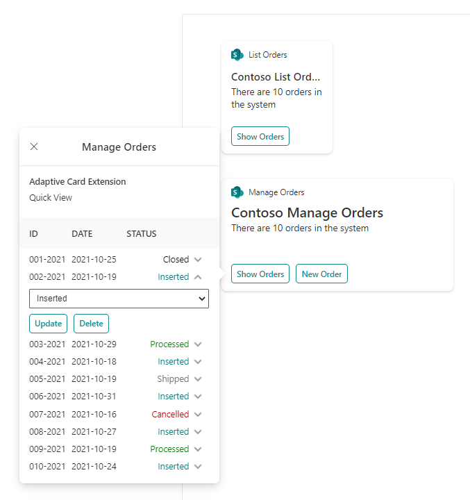
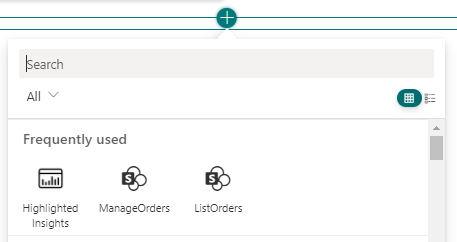

# Contoso Orders - Demo ACE Scenario

## Summary

This is a sample solution that illustrates how to consume a multi-tenant API within a set of Microsoft Viva Connections Adaptive Card Extensions (ACEs) developed with SharePoint Framework (SPFx).
The goal of this sample is to share with partners and ISVs how simple it is to create a modern solution for Microsoft Viva Connections using SharePoint Framework.



## Used SharePoint Framework Version


## Applies to

- [SharePoint Framework](https://aka.ms/spfx)
- [Microsoft Viva Connections](https://www.microsoft.com/en-us/microsoft-viva/connections)
- [Microsoft 365 tenant](https://docs.microsoft.com/en-us/sharepoint/dev/spfx/set-up-your-developer-tenant)

> Get your own free development tenant by subscribing to [Microsoft 365 developer program](http://aka.ms/o365devprogram)

## Prerequisites

The SPFx solution relies on a set of APIs built with .NET Core. The source code of the APIs is available [here](../Contoso.Orders.FunctionApp) in this repository.

## Solution

Solution|Author(s)
--------|---------
Contoso.Orders.SPFx | Paolo Pialorsi - [PiaSys.com](https://www.piasys.com/) - [@PaoloPia](https://twitter.com/PaoloPia)

## Version history

Version|Date|Comments
-------|----|--------
1.0|October 31, 2021|Initial release

## Disclaimer

**THIS CODE IS PROVIDED *AS IS* WITHOUT WARRANTY OF ANY KIND, EITHER EXPRESS OR IMPLIED, INCLUDING ANY IMPLIED WARRANTIES OF FITNESS FOR A PARTICULAR PURPOSE, MERCHANTABILITY, OR NON-INFRINGEMENT.**

---

## Minimal Path to Awesome

- Clone this repository
- Ensure that you are at the solution folder
- Execute the following PowerShell script:
  - [Register-PnPContosoOrders.ps1](..\Scripts\Register-PnPContosoOrders.ps1) with the following syntax

```PowerShell
.\Register-PnPContosoOrders.ps1 -TenantName [name-of-target-tenant]
```

Replace [name-of-target-tenant] with the name of the target tenant. For example, if your tenant name is contoso.onmicrosoft.com, you should provide just the value 'contoso'.

If you like to use a web browser interactive login, for example to rely on MFA, you can use the following syntax:


```PowerShell
.\Register-PnPContosoOrders.ps1 -TenantName [name-of-target-tenant] -LaunchBrowser
```

If you want to provide a pre-defined set of credentials, you can provide a *PSCredential* object with the following syntax:

```PowerShell
.\Register-PnPContosoOrders.ps1 -TenantName [name-of-target-tenant] -Credentials $credentials
```

Where the *$credentials* argument represents a valid *PSCredential* instance.

Regardless how you will start the PowerShell command, follow the instructions on screen and:
- consent the Azure AD application in your browser
- grant the API permissions for the app in the API Access page of SharePoint Online for the API with name "PnP.Contoso.Orders" and for permission scope "Orders.FullControl"

Once you have done that, open the browser and access your target tenant. Browse to the Microsoft Viva Connections dashboard or to the SPFx workbench, edit the page, and add any of the following ACEs:
- ListOrders
- ManageOrders



Configure the ACEs, via the property pane panel on the right side of the screen, in order to use for "OrderService Base Url" the followin value:

https://pnp-contoso-orders.azurewebsites.net/

> For the sake of simplicity, you don't necessarily need to setup the back-end REST API on your own environment. You simply need to rely on a Microsoft-hosted API, which is available at the following URL: https://pnp-contoso-orders.azurewebsites.net/.

## Features

The ACEs included in this project allow you to:
- browse a list of demo orders, via the ListOrders ACE
- browse and manage (add, update, delete) a list of demo orders, via the ManageOrders ACE

## References

- [Getting started with SharePoint Framework](https://docs.microsoft.com/en-us/sharepoint/dev/spfx/set-up-your-developer-tenant)
- [Building for Microsoft teams](https://docs.microsoft.com/en-us/sharepoint/dev/spfx/build-for-teams-overview)
- [Use Microsoft Graph in your solution](https://docs.microsoft.com/en-us/sharepoint/dev/spfx/web-parts/get-started/using-microsoft-graph-apis)
- [Publish SharePoint Framework applications to the Marketplace](https://docs.microsoft.com/en-us/sharepoint/dev/spfx/publish-to-marketplace-overview)
- [Microsoft 365 Patterns and Practices](https://aka.ms/m365pnp) - Guidance, tooling, samples and open-source controls for your Microsoft 365 development